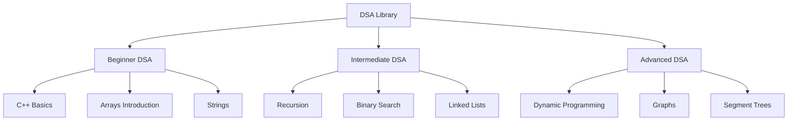
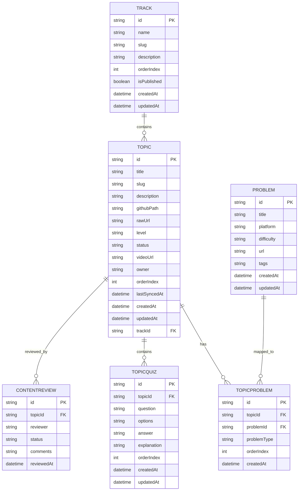
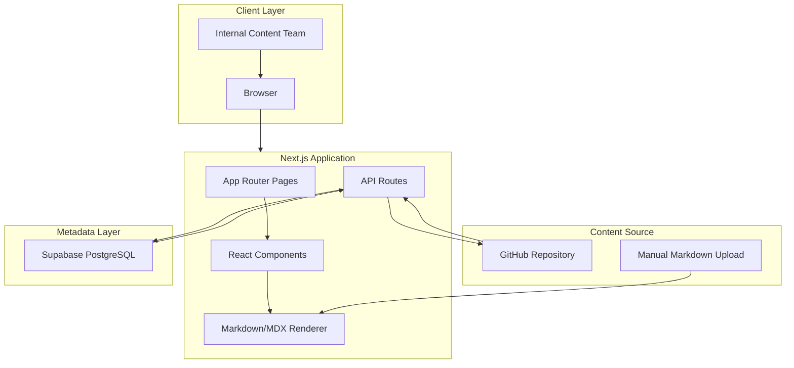

# DSA Library Preview - Project Overview

> A lightweight internal preview platform for DSA learning content

---

## 📋 Table of Contents

- [Problem Statement](#-problem-statement)
- [Target Users](#-target-users)
- [Product Goals](#-product-goals)
- [Features](#-features)
- [Content Architecture](#-content-architecture)
- [Data Architecture](#-data-architecture)
- [Tech Stack](#-tech-stack)
- [Markdown/MDX Content Format](#-markdownmdx-content-format)
- [UI/UX Guidelines](#-uiux-guidelines)
- [Suggested Project Structure](#-suggested-project-structure)
- [MVP Roadmap](#-mvp-roadmap)
- [Future Scope](#-future-scope)

---

## 🎯 Problem Statement

AlgoZenith is revamping its DSA Library into a structured, learner-friendly content experience that combines concise explanations, short videos, quizzes, code examples, and linked practice problems.

Currently, content creation and review can become scattered across Markdown files, Google Docs, spreadsheets, videos, problem links, and internal notes.

| Resource              | Common Location                        |
| --------------------- | -------------------------------------- |
| Topic explanations    | Markdown files, Google Docs, Notion    |
| Video links           | YouTube, Drive, raw recording links    |
| Quizzes               | Docs, sheets, scattered notes          |
| Practice problems     | LeetCode, Codeforces, CodeChef, sheets |
| Topic ownership       | Google Sheets, internal trackers       |
| Content review status | Manual updates, messages, spreadsheets |
| Curriculum hierarchy  | Docs, folders, spreadsheets            |

**The Result:** Content is difficult to preview exactly as learners will see it, review cycles become slower, and the internal team lacks a single place to inspect topic-wise DSA pages.

**The Solution:** DSA Library Preview provides a lightweight internal web app where the team can browse, upload, fetch, and review Markdown/MDX-based DSA content in a clean structured interface before publishing.

---

## 👥 Target Users

| User Type               | Primary Needs                                                               |
| ----------------------- | --------------------------------------------------------------------------- |
| **Content Team**        | Preview Markdown/MDX topic pages before publishing                          |
| **DSA Curriculum Lead** | Review structure, topic sequencing, quizzes, and linked problems            |
| **Video/Editing Team**  | Verify embedded videos, raw links, final video URLs, and topic video status |
| **Problem Curators**    | Check mapped practice problems and extra problem sets                       |
| **Engineering Team**    | Validate Markdown rendering, GitHub sync, and final learner-facing layout   |
| **Internal Reviewers**  | Review topic quality, formatting, correctness, and readiness status         |

---

## 🧭 Product Goals

### Primary Goal

Build a fast, lightweight internal platform to preview DSA Library Markdown/MDX content exactly how it may appear to learners.

### MVP Goals

- Render Markdown/MDX topic files cleanly
- Organize content into Beginner, Intermediate, and Advanced DSA tracks
- Fetch content from a GitHub repository
- Allow manual Markdown upload or paste-based preview
- Display explanations, videos, quizzes, code examples, and practice problems
- Use Supabase as a lightweight metadata/catalogue layer
- Keep the system simple enough to build quickly and iterate later

### Non-Goals for MVP

- Full CMS editing workflow
- Student login and progress tracking
- Payments or course access locking
- Advanced analytics
- Version comparison UI
- Complex approval workflows
- Public SEO-ready learner platform

---

## ✨ Features

### A. Track-Based Curriculum Navigation

The DSA Library is divided into three main tracks.

| Track                | Purpose                                                    | Example Topics                                    |
| -------------------- | ---------------------------------------------------------- | ------------------------------------------------- |
| **Beginner DSA**     | Helps learners build programming and DSA fundamentals      | C++ Basics, Loops, Arrays, Strings, Functions     |
| **Intermediate DSA** | Builds problem-solving depth and common interview patterns | Recursion, Binary Search, Linked Lists, Stacks    |
| **Advanced DSA**     | Covers advanced algorithms and competitive programming     | DP, Graphs, Segment Trees, Tries, Advanced Graphs |

Each track contains multiple topics, and each topic maps to one Markdown/MDX file.

---

### B. Topic Preview Pages

Each topic page should show the full rendered content experience.

A topic can contain:

- Text explanation
- Embedded video
- Code examples
- Complexity analysis
- Visual callouts
- Quizzes
- Related practice problems
- Extra practice problems
- Topic metadata
- Content status

Example topic page sections:

```txt
Arrays Introduction
├── Topic overview
├── Video explanation
├── Core concept
├── C++ implementation
├── Complexity analysis
├── Common mistakes
├── Quiz
├── Practice problems
└── Extra problems
```

---

### C. Manual Markdown Preview

The app should provide a standalone preview page where content writers can quickly test content without pushing to GitHub.

Supported actions:

- Paste Markdown/MDX into a textarea
- Upload a `.md` or `.mdx` file
- Load sample DSA topic content
- View live rendered preview
- Validate formatting visually

This page should work even if Supabase or GitHub integration is not fully configured.

---

### D. GitHub Content Fetching

GitHub should act as the source of truth for content files.

Recommended GitHub structure:

```txt
content/
├── beginner-dsa/
│   ├── cpp-basics/
│   │   └── index.mdx
│   ├── arrays-introduction/
│   │   └── index.mdx
│   └── strings/
│       └── index.mdx
├── intermediate-dsa/
│   ├── recursion/
│   │   └── index.mdx
│   ├── binary-search/
│   │   └── index.mdx
│   └── linked-list/
│       └── index.mdx
└── advanced-dsa/
    ├── dynamic-programming/
    │   └── index.mdx
    ├── segment-tree/
    │   └── index.mdx
    └── graphs-advanced/
        └── index.mdx
```

The app should be able to fetch a Markdown file by path and render it inside the preview interface.

---

### E. Supabase Metadata Catalogue

Supabase should store lightweight metadata for fast navigation and content management.

Supabase should not be the primary source of the Markdown content in the MVP.

Recommended responsibility split:

| Layer         | Responsibility                                      |
| ------------- | --------------------------------------------------- |
| GitHub        | Source of truth for `.md` / `.mdx` content files    |
| Supabase      | Stores tracks, topics, file paths, status, metadata |
| Next.js       | Fetches, renders, and displays content              |
| Manual Upload | Used for quick local preview/testing                |

---

### F. Admin Sync Page

A simple internal sync dashboard should allow the team to inspect content indexing.

MVP version can include:

- Sync GitHub Content button
- Mock sync status
- Indexed topic list
- Last synced timestamp
- Sync errors, if any
- GitHub path display

This can start with mock data and later call a real sync API.

---

## 🧱 Content Architecture

### Curriculum Hierarchy



### Track Model

| Field         | Description                                     |
| ------------- | ----------------------------------------------- |
| `id`          | Unique track ID                                 |
| `name`        | Human-readable track name                       |
| `slug`        | URL-safe track identifier                       |
| `description` | Short description of the track                  |
| `orderIndex`  | Display order                                   |
| `isPublished` | Whether track is ready for learner-facing usage |

### Topic Model

| Field          | Description                               |
| -------------- | ----------------------------------------- |
| `id`           | Unique topic ID                           |
| `trackId`      | Parent track ID                           |
| `title`        | Topic title                               |
| `slug`         | URL-safe topic identifier                 |
| `description`  | Short summary                             |
| `githubPath`   | Path to the Markdown/MDX file in GitHub   |
| `rawUrl`       | Raw GitHub file URL, optional             |
| `level`        | beginner / intermediate / advanced        |
| `status`       | draft / in-review / ready / published     |
| `videoUrl`     | Final or preview video URL                |
| `owner`        | Content owner or team member              |
| `orderIndex`   | Topic order inside the track              |
| `lastSyncedAt` | Last time metadata was synced from GitHub |

---

## 🗄️ Data Architecture

### Entity Relationship Diagram



---

## 🧩 Supabase Schema

> This schema is intentionally lightweight for the MVP. More advanced tables can be added later if the preview app evolves into a full content management system.

### `tracks`

```sql
create table tracks (
  id uuid primary key default gen_random_uuid(),
  name text not null,
  slug text not null unique,
  description text,
  order_index int default 0,
  is_published boolean default false,
  created_at timestamp with time zone default now(),
  updated_at timestamp with time zone default now()
);
```

### `topics`

```sql
create table topics (
  id uuid primary key default gen_random_uuid(),
  track_id uuid references tracks(id) on delete cascade,
  title text not null,
  slug text not null,
  description text,
  github_path text,
  raw_url text,
  level text check (level in ('beginner', 'intermediate', 'advanced')),
  status text default 'draft' check (status in ('draft', 'in-review', 'ready', 'published')),
  video_url text,
  owner text,
  order_index int default 0,
  last_synced_at timestamp with time zone,
  created_at timestamp with time zone default now(),
  updated_at timestamp with time zone default now(),
  unique(track_id, slug)
);
```

### `problems` - Optional for Later

```sql
create table problems (
  id uuid primary key default gen_random_uuid(),
  title text not null,
  platform text not null,
  difficulty text,
  url text not null,
  tags text[],
  created_at timestamp with time zone default now(),
  updated_at timestamp with time zone default now()
);
```

### `topic_problems` - Optional for Later

```sql
create table topic_problems (
  id uuid primary key default gen_random_uuid(),
  topic_id uuid references topics(id) on delete cascade,
  problem_id uuid references problems(id) on delete cascade,
  problem_type text default 'practice' check (problem_type in ('primary', 'practice', 'extra')),
  order_index int default 0,
  created_at timestamp with time zone default now(),
  unique(topic_id, problem_id)
);
```

### Seed Data for Tracks

```sql
insert into tracks (name, slug, description, order_index)
values
('Beginner DSA', 'beginner-dsa', 'Foundational programming and DSA concepts for beginners.', 1),
('Intermediate DSA', 'intermediate-dsa', 'Core problem-solving patterns and interview-focused DSA topics.', 2),
('Advanced DSA', 'advanced-dsa', 'Advanced algorithms, data structures, and competitive programming topics.', 3);
```

---

## 🛠️ Tech Stack

### Architecture Diagram



### Technology Choices

| Category              | Technology                      | Notes                                               |
| --------------------- | ------------------------------- | --------------------------------------------------- |
| **Framework**         | Next.js App Router              | Routing, API routes, server-side GitHub fetching    |
| **Language**          | TypeScript                      | Safer development and cleaner data models           |
| **UI**                | React + TailwindCSS             | Fast, responsive UI development                     |
| **UI Components**     | shadcn/ui                       | Clean internal dashboard components                 |
| **Markdown Renderer** | MDX / React Markdown            | Render rich Markdown content with custom components |
| **Markdown Plugins**  | remark-gfm, gray-matter, rehype | Tables, frontmatter, headings, syntax highlighting  |
| **Database**          | Supabase PostgreSQL             | Metadata catalogue for tracks and topics            |
| **Content Source**    | GitHub Repository               | Source of truth for Markdown/MDX files              |
| **Deployment**        | Vercel                          | Fast deployment for Next.js                         |

### Recommended Libraries

```bash
npm install @supabase/supabase-js gray-matter react-markdown remark-gfm rehype-slug rehype-autolink-headings rehype-highlight
```

For MDX support:

```bash
npm install next-mdx-remote @mdx-js/react
```

For UI:

```bash
npx shadcn@latest init
npx shadcn@latest add button card badge tabs scroll-area input textarea separator sheet
npm install lucide-react
```

---

## 📝 Markdown/MDX Content Format

### Recommended File Format

Each topic should be stored as an `index.mdx` file with frontmatter.

````mdx
---
title: Arrays Introduction
slug: arrays-introduction
track: beginner-dsa
level: beginner
order: 2
status: draft
videoUrl: https://www.youtube.com/watch?v=example
owner: content-team
---

# Arrays Introduction

Arrays are one of the most fundamental data structures.

:::video
https://www.youtube.com/watch?v=example
:::

## What is an Array?

An array stores multiple values of the same type in contiguous memory.

## C++ Example

```cpp
#include <bits/stdc++.h>
using namespace std;

int main() {
    vector<int> arr = {1, 2, 3, 4, 5};
    cout << arr[0] << endl;
    return 0;
}
```
````

## Complexity

| Operation | Complexity |
| --------- | ---------- |
| Access    | O(1)       |
| Search    | O(n)       |
| Insert    | O(n)       |
| Delete    | O(n)       |

:::quiz
question: What is the time complexity of accessing an array element by index?
options: O(1), O(log n), O(n), O(n log n)
answer: O(1)
explanation: Array elements can be accessed directly using their index.
:::

:::problem
title: Two Sum
platform: LEETCODE
difficulty: Easy
url: https://leetcode.com/problems/two-sum/
:::

````

---

## 🧱 Custom Content Blocks

### Video Block

```md
:::video
https://www.youtube.com/watch?v=example
:::
````

Rendered as an embedded video player or video link card.

### Quiz Block

```md
:::quiz
question: What is the time complexity of binary search?
options: O(n), O(log n), O(1), O(n log n)
answer: O(log n)
explanation: Binary search halves the search space each step.
:::
```

Rendered as a quiz card.

### Problem Block

```md
:::problem
title: Two Sum
platform: LEETCODE
difficulty: Easy
url: https://leetcode.com/problems/two-sum/
:::
```

Rendered as a problem card.

### Callout Block

```md
:::callout
Remember: Arrays provide O(1) access by index but insertion in the middle is O(n).
:::
```

Rendered as a highlighted note.

---

## 🎨 UI/UX Guidelines

### Design Principles

- **Clean and educational** - The content should be easy to read and review
- **Internal-tool friendly** - Fast navigation and minimal friction
- **Programiz-style clarity** - Simple explanations, readable spacing, strong structure
- **AlgoMonster-style navigation** - Topic sidebar and structured learning hierarchy
- **Markdown-first** - The rendered page should reflect the source content accurately
- **Low clutter** - Avoid excessive dashboards or admin complexity in MVP

---

### Layout Structure

```txt
┌─────────────────────────────────────────────────────────────┐
│  DSA Library Preview                         Search  Admin  │
├────────────────┬──────────────────────────────┬─────────────┤
│                │                              │             │
│  TRACKS        │  Arrays Introduction         │  ON THIS    │
│  ─────────     │  ─────────────────────       │  PAGE       │
│  Beginner DSA  │  Topic metadata              │  ───────    │
│  Intermediate  │                              │  Overview   │
│  Advanced DSA  │  Markdown content            │  Code       │
│                │                              │  Quiz       │
│  TOPICS        │  Video block                 │  Problems   │
│  ─────────     │  Code examples               │             │
│  C++ Basics    │  Quiz                        │             │
│  Arrays        │  Practice problems           │             │
│  Strings       │                              │             │
│                │                              │             │
└────────────────┴──────────────────────────────┴─────────────┘
```

---

### Main Pages

| Page                              | Purpose                              |
| --------------------------------- | ------------------------------------ |
| `/`                               | Home page with track cards           |
| `/tracks/[trackSlug]`             | Shows topics inside a selected track |
| `/tracks/[trackSlug]/[topicSlug]` | Renders selected topic content       |
| `/preview`                        | Manual Markdown upload/paste preview |
| `/admin/sync`                     | GitHub sync and indexed topic status |

---

### Component List

| Component           | Purpose                                            |
| ------------------- | -------------------------------------------------- |
| `AppShell`          | Base layout wrapper                                |
| `Header`            | Top navigation                                     |
| `TrackCard`         | Displays each DSA track                            |
| `TopicCard`         | Displays topic summary                             |
| `StatusBadge`       | Shows draft / in-review / ready / published status |
| `SidebarNav`        | Track and topic navigation                         |
| `TableOfContents`   | Right-side heading navigation                      |
| `MarkdownRenderer`  | Renders Markdown/MDX content                       |
| `VideoBlock`        | Renders embedded video                             |
| `QuizBlock`         | Renders quiz card                                  |
| `ProblemCard`       | Renders linked practice problem                    |
| `CalloutBlock`      | Renders highlighted content note                   |
| `FileUploadPreview` | Handles manual Markdown upload                     |
| `EmptyState`        | Handles no-data states                             |
| `SyncStatusCard`    | Shows GitHub sync state                            |

---

### Status Colors

```css
:root {
  --status-draft: #6b7280;
  --status-in-review: #f59e0b;
  --status-ready: #3b82f6;
  --status-published: #10b981;
}
```

### Track Colors

```css
:root {
  --track-beginner: #10b981;
  --track-intermediate: #3b82f6;
  --track-advanced: #8b5cf6;
}
```

---

### Responsive Behavior

| Viewport            | Sidebar            | Layout                                 |
| ------------------- | ------------------ | -------------------------------------- |
| Desktop `≥1024px`   | Visible            | Sidebar + content + table of contents  |
| Tablet `768-1023px` | Collapsible drawer | Content-focused layout                 |
| Mobile `<768px`     | Hidden drawer      | Stacked content, simplified navigation |

---

## 📁 Suggested Project Structure

```txt
dsa-library-preview/
├── src/
│   ├── app/
│   │   ├── page.tsx
│   │   ├── preview/
│   │   │   └── page.tsx
│   │   ├── tracks/
│   │   │   ├── [trackSlug]/
│   │   │   │   ├── page.tsx
│   │   │   │   └── [topicSlug]/
│   │   │   │       └── page.tsx
│   │   ├── admin/
│   │   │   └── sync/
│   │   │       └── page.tsx
│   │   ├── api/
│   │   │   ├── github/
│   │   │   │   ├── content/
│   │   │   │   │   └── route.ts
│   │   │   │   └── tree/
│   │   │   │       └── route.ts
│   │   │   └── sync/
│   │   │       └── route.ts
│   │   ├── layout.tsx
│   │   └── globals.css
│   ├── components/
│   │   ├── layout/
│   │   │   ├── AppShell.tsx
│   │   │   ├── Header.tsx
│   │   │   └── SidebarNav.tsx
│   │   ├── markdown/
│   │   │   ├── MarkdownRenderer.tsx
│   │   │   ├── VideoBlock.tsx
│   │   │   ├── QuizBlock.tsx
│   │   │   ├── ProblemCard.tsx
│   │   │   ├── CalloutBlock.tsx
│   │   │   └── CodeBlock.tsx
│   │   ├── tracks/
│   │   │   ├── TrackCard.tsx
│   │   │   └── TopicCard.tsx
│   │   ├── preview/
│   │   │   └── FileUploadPreview.tsx
│   │   ├── admin/
│   │   │   └── SyncStatusCard.tsx
│   │   └── shared/
│   │       ├── StatusBadge.tsx
│   │       ├── EmptyState.tsx
│   │       └── TableOfContents.tsx
│   ├── lib/
│   │   ├── mock-data.ts
│   │   ├── github.ts
│   │   ├── supabase.ts
│   │   ├── markdown.ts
│   │   └── constants.ts
│   ├── types/
│   │   ├── track.ts
│   │   ├── topic.ts
│   │   └── markdown.ts
│   └── hooks/
│       └── useTableOfContents.ts
├── scripts/
│   └── sync-github-content.ts
├── public/
├── .env.example
├── package.json
├── next.config.ts
├── tsconfig.json
└── README.md
```

---

## 🔐 Environment Variables

```env
NEXT_PUBLIC_SUPABASE_URL=
NEXT_PUBLIC_SUPABASE_ANON_KEY=
SUPABASE_SERVICE_ROLE_KEY=
GITHUB_TOKEN=
GITHUB_OWNER=
GITHUB_REPO=
GITHUB_BRANCH=main
```

Important:

- `GITHUB_TOKEN` should only be used server-side.
- `SUPABASE_SERVICE_ROLE_KEY` should never be exposed to the browser.
- The app should fall back to mock data if GitHub/Supabase is not configured.

---

## 🚀 MVP Roadmap

### Phase 1: Local Prototype

- [ ] Initialize Next.js project with TypeScript and TailwindCSS
- [ ] Set up base layout and navigation
- [ ] Create mock tracks and topics
- [ ] Build home page with track cards
- [ ] Build track page with topic cards
- [ ] Build topic preview page using mock Markdown content

### Phase 2: Markdown Preview Experience

- [ ] Build `MarkdownRenderer`
- [ ] Support headings, tables, lists, links, images, and code blocks
- [ ] Add syntax highlighting
- [ ] Add custom blocks for video, quiz, problem, and callout
- [ ] Build `/preview` page for paste/upload preview
- [ ] Add sample content loader

### Phase 3: GitHub Integration

- [ ] Create `fetchMarkdownFromGitHub(path)` helper
- [ ] Add API route for fetching GitHub file content
- [ ] Connect topic preview page to GitHub file path
- [ ] Handle loading/error states
- [ ] Add GitHub source link on topic page

### Phase 4: Supabase Metadata

- [ ] Create Supabase project
- [ ] Add `tracks` and `topics` tables
- [ ] Seed initial tracks
- [ ] Create Supabase client helper
- [ ] Fetch tracks/topics from Supabase
- [ ] Keep mock fallback for local development

### Phase 5: Sync Dashboard

- [ ] Build `/admin/sync` page
- [ ] Create mock sync UI
- [ ] Add script to scan GitHub content folder
- [ ] Parse frontmatter from topic files
- [ ] Upsert topic metadata into Supabase
- [ ] Display indexed topics and sync status

### Phase 6: Polish and Deployment

- [ ] Improve responsive layout
- [ ] Add table of contents
- [ ] Add status badges
- [ ] Add empty states and error states
- [ ] Deploy to Vercel
- [ ] Test with 5-10 real DSA topic files

---

## 🔮 Future Scope

### Content Management

- Full internal CMS editor
- Topic creation from UI
- GitHub pull request creation from app
- Version history and diff preview
- Reviewer comments and approval workflow

### Learning Platform Features

- Student login
- Topic completion tracking
- Quiz attempts
- Problem-solving progress
- Bookmarks
- Paid/free content locking

### Content Quality Features

- Markdown linting
- Broken link checker
- Missing video checker
- Problem URL validator
- Quiz validation
- Frontmatter validation

### Analytics

- Topic completion rate
- Video completion rate
- Quiz accuracy
- Problems solved after reading
- Drop-off points in content

### SEO/Public Library

- Public learner-facing topic pages
- SEO metadata per topic
- Structured data for educational content
- Public sitemap
- Canonical URLs

---

## ✅ MVP Success Criteria

The MVP should be considered successful if:

- The team can browse Beginner, Intermediate, and Advanced DSA tracks
- The team can open a topic and see rendered Markdown content
- Videos, quizzes, code blocks, tables, and problem cards render cleanly
- A content writer can upload or paste Markdown and preview it instantly
- Topic metadata can be managed through Supabase or mock data
- Markdown files can be fetched from GitHub by path
- The app is deployed and usable internally

---

## 🧠 Final Technical Direction

Use this architecture for the MVP:

```txt
GitHub = source of truth for content files
Supabase = metadata catalogue for tracks and topics
Next.js = rendering, routing, API layer, and preview UI
Manual upload = quick content testing workflow
```

This keeps the product lightweight, fast to build, and flexible enough to evolve into either an internal content QA tool or a public learner-facing DSA library later.

---
